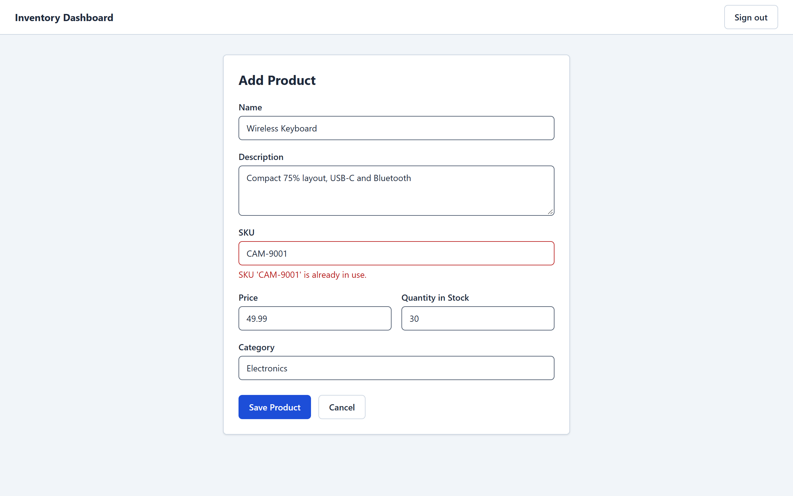
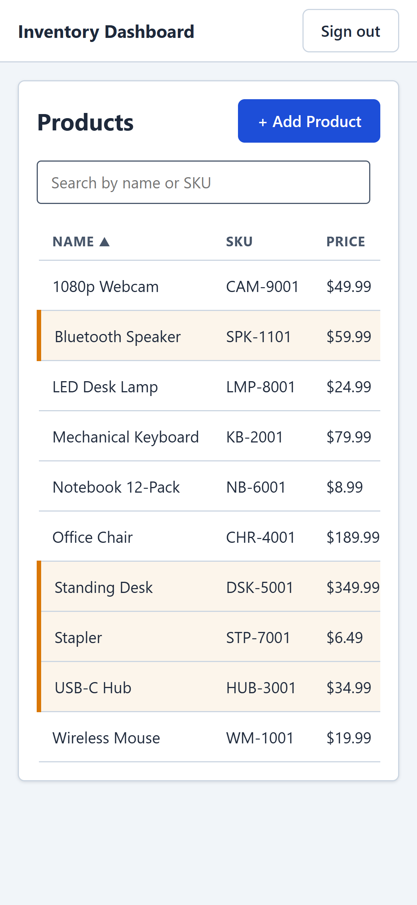

# Inventory Dashboard — Frontend

A small inventory-management web app: sign in, then add, edit, search, sort and delete products.
Built with Angular 22 and TypeScript, backed by a .NET API on Azure.

- **Live app:** https://happy-pond-0aab59f00.3.azurestaticapps.net
- **API repo (.NET 10):** https://github.com/manzcoder711/inventory-dashboard-api

<p>
  
</p>

## Try it

Open the live app and press **Sign in as demo user** (`demo@example.com` / `Demo123!`). It is a shared
demo account, so feel free to add, edit or delete products.

> **The first visit after a quiet spell is slow.** The API and its database run on Azure's free tier
> and go to sleep when idle, so the first request can take a minute or more. The app shows a
> "Waking up the free-tier server" message while it waits.

## What it does

- **One-click demo sign-in**, or sign in with an email and password.
- **Product list** with search by name or SKU, sortable columns (name, price, quantity), and a
  **Low** badge on anything with 10 units or fewer. It shows a loading skeleton and an empty state.
- **Add and edit products** with validation. Reusing an existing SKU shows the error next to the SKU
  field instead of a generic failure.
- **Delete** asks for confirmation first. Saving, updating and deleting show a short toast.
- **Works on a phone.** At 375px wide the table scrolls sideways inside its card.

| Duplicate SKU, caught inline | On a phone |
|---|---|
|  |  |

## Tech stack

| Area | Choice |
|---|---|
| Framework | Angular 22: standalone components, signals, `@if` / `@for`, no zone.js |
| Language | TypeScript with `strict` and `strictTemplates` on |
| HTTP and forms | `HttpClient` with functional interceptors, reactive forms, RxJS |
| Styling | Plain SCSS on CSS custom properties (design tokens); see [DESIGN.md](DESIGN.md) |
| Tests | Vitest with Angular's test bed and `HttpTestingController` |
| Quality | ESLint (angular-eslint) and Prettier, both enforced in CI |
| Hosting | Azure Static Web Apps, deployed by GitHub Actions |

## How it is put together

```
src/app/
  auth/          AuthService, route guard, auth interceptor, login page
  components/    product-list, product-form
  services/      ProductService (all product HTTP calls)
  shared/        toast, server-wake message
  models/        Product type
```

- **Sign-in state** is a signal in `AuthService`. The JWT is kept **in memory only** (not in
  `localStorage`), so other scripts can't read it, and refreshing the page signs you out.
- **A route guard** sends signed-out visitors to `/login`.
- **An auth interceptor** adds the `Authorization: Bearer` header to API calls, and signs the user out
  if the API answers `401`.
- **A server-wake interceptor** notices when an API call is taking longer than 3 seconds and shows the
  "waking up" message until it finishes, whether it succeeds or fails.
- **Friendly errors.** The login page tells a wrong password (`401`), a rate limit (`429`) and an
  unreachable server apart, rather than blaming the password every time.

## Accessibility

Lighthouse on the live site (desktop, 2026-09-30): **Accessibility 100** and **Best Practices 100** on
the login page, the product list and the add-product form; **Performance 97** on the login page load.

What that rests on:

- Sortable columns are real buttons with `aria-sort`, usable by keyboard.
- A visible focus ring on everything focusable.
- Field errors are linked to their inputs with `aria-invalid` and `aria-describedby`; page-level errors
  use `role="alert"`.
- The scrolling table is a labelled, keyboard-focusable region.
- Text colours meet WCAG AA contrast (the measured ratios are in [DESIGN.md](DESIGN.md)); low stock is
  shown with a text badge as well as colour.

## What is tested

18 automated tests, run in CI before anything is deployed:

- **`ProductService` (6):** each call uses the right URL, method and body, and a `409` reaches the
  caller with the server's message.
- **Product form (2):** a duplicate SKU shows an inline error under the SKU field, with no toast and no
  navigation away, and the error clears as soon as you edit the field.
- **Login page (3):** `401`, `429` and server errors each show the right message.
- **Waking message (3):** hidden under 3 seconds, shown after, and gone again on success and on failure.
- **App shell (3) and product list (1):** one toast host; Sign out appears only when signed in and
  returns to the login page; the list loads its products on start.

There are no end-to-end browser tests, and code coverage isn't measured.

## Run it locally

You need **Node.js** `^22.22.3`, `^24.15` or newer (see `engines` in `package.json`).

```bash
git clone https://github.com/manzcoder711/inventory-dashboard-frontend.git
cd inventory-dashboard-frontend
npm ci
```

**Choose where the app gets its data.** The development build reads its API address from
[`src/environments/environment.development.ts`](src/environments/environment.development.ts).

- **Option A, no backend setup:** point it at the live demo API. Change `apiUrl` to
  `https://inventory-api-forin-abbjggaqh3agf2ce.southindia-01.azurewebsites.net/api`. The API already
  allows requests from `http://localhost:4200`. You will be working on the shared demo data.
- **Option B, your own backend:** leave it as `http://localhost:5298/api` and run the API from its
  [repo](https://github.com/manzcoder711/inventory-dashboard-api) (its README covers the database).

Then start the dev server and open http://localhost:4200:

```bash
npm start
```

Other commands:

```bash
npm run lint                  # ESLint
npm run format:check          # Prettier
npx ng test --watch=false     # unit tests, run once
npm run build                 # production build into dist/inventory-dashboard
```

## Deployment

Pushing to `main` runs the GitHub Actions workflow in `.github/workflows/`: install, lint, format
check, tests, production build, then deploy to Azure Static Web Apps. A failure in any of the first
four steps stops the run before anything is built or deployed. Pull requests run the same checks.
Only Dependabot's are kept from deploying, since they don't get the repo's secrets.

[`public/staticwebapp.config.json`](public/staticwebapp.config.json) makes deep links and page
refreshes work (every path falls back to `index.html`) and sets the security headers, including an
enforced `Content-Security-Policy` that only lets the app load scripts, styles and data from itself
and its own API. It was first rolled out in report-only mode and checked against a full walkthrough
of the live site (sign in, add, edit, delete, sign out) with no violations before being enforced.

## Deliberately not built

- **Roles.** Every signed-in user can do everything.
- **Staying signed in across refreshes.** Tokens live in memory only, on purpose.
- **A dashboard summary** (totals, stock value).
- **Paging.** The list loads every product, which is fine at demo size.
- **Browser-based end-to-end tests.**
